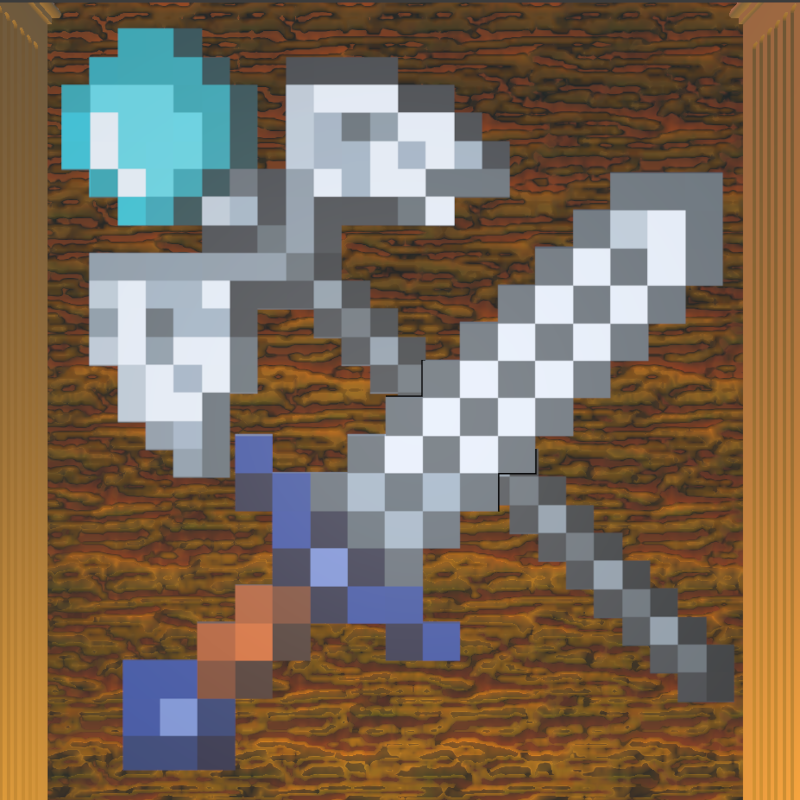
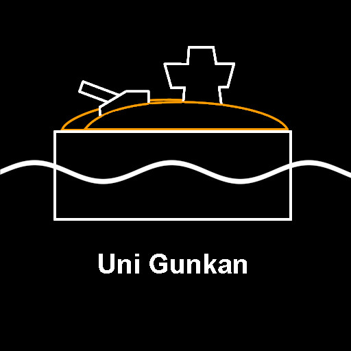

# PixelDungeons

 

武器を駆使しながら敵を倒してステージを進めていく、ハックアンドスラッシュ要素を中心としたゲームです。

## 概要
**草原**、**天空**、**魔王城**の3ステージから構成されています。最終ステージのラスボスを倒すとゲームクリアです。

### クラフト
ステージに挑む前に、ホームで武器や防具を装備することができます。素材から製造した好きなものを身に着けて挑めます。

### 戦闘
プレイヤーは**剣**（近距離型）、**魔法の杖**（遠距離型）、**防具**を持つことができます。

敵を倒すと素材が入手でき、次のステージ前にホームで武器を製造することができます。

## デモプレイ

    

<a href="https://unityroom.com/games/pixeldungeons">
    <h3>
        
▶ プレイはこちらから

    </h3>
</a>

## 制作者
このゲームは複数人で開発されたものです。

    

    <i>Copyright (c) 2024-2025 うに軍艦</i>

    <a href="/LICENSE">See license</a>

